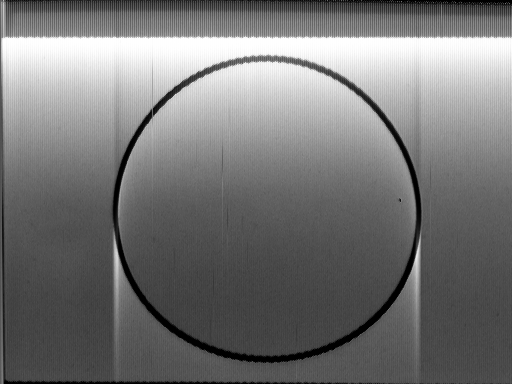
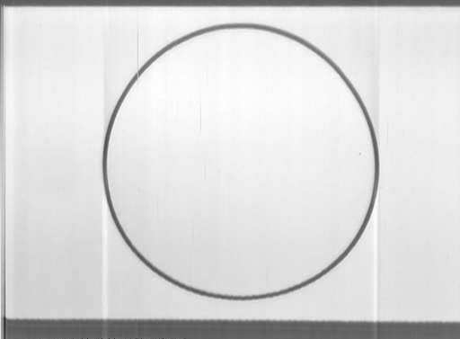
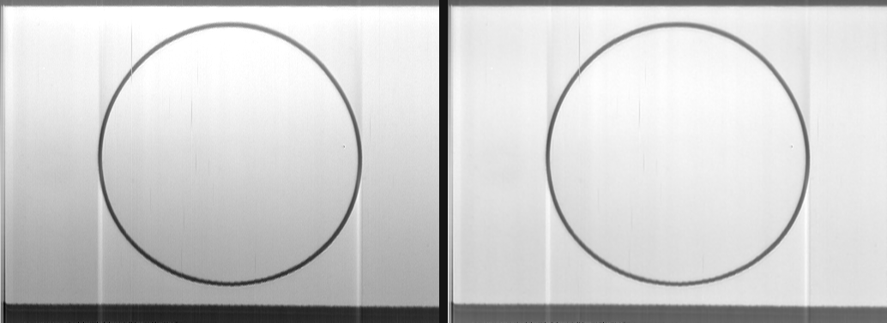

# Golden Record: Decode

There are 116 photographs bolted to the side of two spacecraft leaving the solar system.
They aren't stored as pictures — they're stored as **sound**, about eight minutes of harsh
buzzing pressed into a gold-plated copper phonograph record.

This is a decoder that turns that sound back into pictures. **It is Python, and you can run it
yourself** — see [Running the decoder yourself](#running-the-decoder-yourself). A browser port
is planned and deliberately parked: getting the decode right comes first, and it is not right
yet.

**[Browse all 116 decoded images →](https://gourneau.github.io/golden-record-images/)**

### Where to go from here

| | |
|---|---|
| **[How the decoding works](DECODING.md)** | The method, for a general audience. No signal processing assumed. Start here. |
| **[What this decoder found](docs/findings.md)** | The seven measurements, in signal-processing detail. |
| **[The machine learning](docs/ML_HANDOFF.md)** | Four methods, one shipped, four nulls, and the arbiter they were all judged by. |
| **[What an alien could recover](ALIENS.md)** | Which parts of this a recipient could actually do, and where the record lets its reader down. |
| **[What didn't work](docs/what-didnt-work.md)** | Nine ideas built, measured and rejected. A map of the holes in this signal. |
| **[Corrections and retractions](docs/corrections.md)** | Everything we got wrong, and findings that bear on Wikipedia and Commons. |
| **[Orientation](docs/orientation.md)** | Which way up each image goes, and how much of that the record encodes. |

<p align="center">
  
  
</p>

*Image 1 on the record is a circle — a self-checking test pattern, so recipients can tell
whether they've decoded it correctly. Left: the 2017 method, decoded here with its 2680-sample
picture window, which produces an ellipse of axis ratio **1.0485** that had to be nudged by hand.
Right: this decoder at **1.0054**, with no fudge factor. Both are regenerated from the master by
`python -m pipeline.figures`, so neither can drift away from what the code actually does.*

<p align="center">
  
</p>

*The defect that took longest to find. Left: the field sags 88 grey levels from the top of each
trace to the bottom, on a slide that is uniform white by design. Right: 21. The cause is an error
that **accumulates down each trace in proportion to the light already sent**, reset once per trace
by the porch clamp — which makes it the same mechanism behind the brightness droop and the
vertical streaking. See below for how the record itself proves it.*

---

## Standing on other people's shoulders

**This project exists because of [Ron Barry](https://github.com/foodini).** In 2017 he sat in
a talk at the Exploratorium, recognised the scan-line glyph on the record cover, and then spent
two weeks working out — deliberately, from the cover alone, refusing to look anything up —
how to get the pictures back. He wrote [`foodini/voyager`](https://github.com/foodini/voyager)
and an accompanying essay, *The Voyager Image Decoding Method*, which is the single best
document on this subject and which you should read.

He also did something rarer than solving the problem: he wrote down, precisely and without
defensiveness, everything that was still wrong with his result. His TODO list — the brightness
decay he couldn't explain, the "shadow and anti-shadow" around bright objects, the jitter he
fixed with what he called a "brainless heuristic", the colour channels off by a pixel, his
suspicion that there was more fidelity in the data than he was extracting — is the direct
roadmap for this repository. Nearly every improvement here is an answer to a question he
asked first and asked well.

His hand-tuned table of where each of the 156 frames begins, produced by zooming into
waveforms in Audacity one at a time, remains the only published index of the image track. This
decoder still uses it as its starting seed. It is in
[`pipeline/barry_tables.json`](pipeline/barry_tables.json), parsed directly from his source.

**[David Pescovitz](https://boingboing.net/author/david_pescovitz)** obtained access to the
master tapes while producing the Ozma Records 40th-anniversary vinyl edition of the Golden
Record (with Timothy Daly and Lawrence Azerrad), and gave Barry the high-fidelity audio that
makes any of this possible. Without that, everyone would still be decoding a lossy MP3. He
wrote up Barry's work at Boing Boing:
**[How to decode the images on the Voyager Golden Record](https://boingboing.net/2017/09/05/how-to-decode-the-images-on-th.html)**.

**The [Internet Archive](https://archive.org/details/voyager.decode)** hosts the 384 kHz
master digitisation, Barry's decoder, and his essay. That item is the source of every number
in this project.

**The people who made the thing in the first place**, in 1977: Carl Sagan, who chaired the
committee; Frank Drake, who devised the encoding and the cover notation; Ann Druyan, creative
director; Timothy Ferris, producer; Jon Lomberg, design director; and Linda Salzman Sagan.
And the engineers at **Colorado Video** in Boulder, who built the one-off machine that turned
each projected slide into a few seconds of audio. Their scan-conversion hardware is the thing
this repository is reverse-engineering, and it was built well.

**Others who have decoded this record**, whose work I read before starting — several of whom
solved parts of this independently and better than I would have:
[MalteGruber/voyager-record-decoder](https://github.com/MalteGruber/voyager-record-decoder)
(in-browser, and the first to note the digitisation's high-pass artefacts),
[MarcBaeuerle/Golden-record-images](https://github.com/MarcBaeuerle/Golden-record-images)
(real-time browser decoding; independently found the two-line sync structure),
[Aurélien Ginolhac's R walkthrough](https://ginolhac.github.io/posts/2024-07-26_decoding-golden-record/),
[amazing-rando/voyager-decoder](https://github.com/amazing-rando/voyager-decoder),
[aizquier/voyagerimb](https://github.com/aizquier/voyagerimb),
[tomswartz07/voyager](https://github.com/tomswartz07/voyager), and
[mmcc1/Voyager-Golden-Record-Decoder](https://github.com/mmcc1/Voyager-Golden-Record-Decoder).

---

## The chain error, and how the record proves it

Every previously published decode of this record sags: flat areas drift toward mid-grey down each
trace, and vertical streaks run through the picture. Barry documented it in 2017 and could not
solve it.

It is **one** defect, not two: an error that accumulates down each trace in proportion to the
light already sent, reset once per trace by the porch clamp.

**The record contains its own proof, in a place nothing here had used.** The slide mount appears
twice on every frame — before the picture and after it. It is one physical object, so both
readings must agree, and the candidate explanations disagree about *how*:

| explanation | prediction |
|---|---|
| shading (multiplicative) | the mount is dark, so **both ends read alike** |
| a per-trace gain or offset | **both ends move together** |
| an accumulating error | **only the end darkens**, in proportion to that trace's light |

Measured over twelve frames spanning both channels and the whole record, regressing each mount
reading on its own trace's mean level:

| | median slope | negative on |
|---|---|---|
| bottom mount | **−0.284** | **12 of 12** |
| top mount | +0.054 | 3 of 12 |

The sign flip rules out both alternatives at once. The inverse is exact — the forward error is a
running sum, so the inverse is the matching recursion, one measured parameter and nothing tuned.
Fitted on the mounts of 68 frames with the calibration frame excluded:

    mount gap, 13 held-out frames   1.404 → 0.283   (−80%)
    L000 level fall                 88 → 20 grey levels
    white clipping                  5.99% → 0.12%
    circle geometry                 unmoved

**It costs something, which is why the pictures are offered two ways.** The correction removes
20–42% of the droop and *raises* the streak amplitude 24–96% — the inverse is a running sum, and
integration cannot tell signal from an error in that trace's starting level. The denoiser is what
makes the trade worth taking. The gallery offers **no correction** and **denoised**, never
blended, so you can judge rather than take our word.
[Why, and what was tried →](docs/what-didnt-work.md)

## The machine learning

Four methods were tried against one arbiter: **predict measurements the model was never shown.**
Not image metrics — this project measured that its own quality composite *rewards blur*, and that
every method's metrics keep improving past the correct setting.

**What ships is Noise2Noise on the colour repeats: 19 of 19 unseen scenes, beating a blur control
on every one.** Its premise is a property of the artifact nobody had used: **twenty
images were scanned three times**, through red, green and blue filters, which is twenty sets of
three independent noisy observations of one scene. Noise2Noise proves a network trained to map one
noisy observation to another converges on the clean-target estimator. The literature's stated
obstacle is that independent noisy pairs are hard to obtain; this record carries sixty frames of
them — and **a recipient could do all of it**, since no Earth photograph is involved and the method
never asks which separation is red.

Read the high-band figure with its control beside it: the network reaches +7.74 dB and **a plain
Gaussian blur reaches +7.46 dB**, because there is almost no camera signal above 0.40 cyc/px to
protect. What separates them is the low band, where blur is worse than doing nothing on 16 of 19
scenes and the network is better on 16 of 19. The dB is not the evidence; the conjunction is.

Nine other ideas were built, measured and rejected — including one of ours that would have looked
like a success while doing nothing at all. **[What didn't work, and why →](docs/what-didnt-work.md)**
That page is the first thing to read if you are picking this up: it is a map of the holes this
particular signal has waiting in it.

## Fork it — there is real headroom here

**Please take this further.** The decode is good and it is not finished, and the parts most likely
to yield are exactly the parts that want more compute and more ideas than one person brought.

Everything you need is in the repository: the master is one command away
(`python -m pipeline.fetch`), the arbiter is written down, and the tier system tells you
immediately whether an idea is legitimate or is smuggling in knowledge a recipient of the record
could not have.

Where the headroom is, honestly:

- **The 96 monochrome images have no held-out measurement.** A colour separation *is* a single
  scan, so mono-ness is not the gap — the gap is that no scored scene was line art or a diagram.
  Find an arbiter for those and a lot opens up.
- **The chain correction amplifies streaks** by 24–96% while removing 20–42% of the droop. The
  mechanism is understood and the inverse is exact; what is missing is a way to stop the
  per-trace clamp residual being integrated into a ramp. One attempt is in the repository,
  switched off, with its failure measured.
- **An 8σ cross term** in the ring PSF is real and unexplained — and the same diagonal signature
  turns up in the circle's residual ellipticity. That may be a coincidence. It may be the last
  thing.
- **Deep image prior scores better than what ships** (3/3 against 1/6 for the neural field) and
  was not shipped only because it costs ~10 minutes a frame. A GPU and some patience would settle
  whether it is actually better.

Two rules, and they are the whole discipline: **judge by prediction of data the method never saw**,
never by an image metric — this project measured that its own quality composite *rewards blur*.
And **keep the tiers apart**: `python -m pipeline.provenance` will tell you if you have crossed the
line. A prettier picture is not a truer one, and on a message meant for strangers the difference
matters more than usual.

## What the decoder was allowed to know

This project wants two things that pull against each other: a **clean-room decode**, recovering
the pictures from the artifact alone the way a recipient who has never heard of Earth would have
to — and the **best pictures we can get**, which means using the original slides to check our work.

Both are worth having. Mixing them silently is what would make the result worthless, because you
could not tell which claims survive without Earth knowledge. So every shipped artifact carries a
tier, and **the boundary is asserted in code, not promised in prose** (`pipeline/provenance.py`,
run it to see the report and the check):

| Tier | What it may use | Examples |
|---|---|---|
| **0 · Record** | the audio and the engraved cover. *This is what an alien has.* | every decoded pixel, the timebase, the dot clock, geometry, the droop inverse, the circle metrics |
| **1 · Universal** | priors any observer could hold without knowing Earth | denoising, triplet fusion, deconvolution by the measured PSF |
| **2 · Earth** | the original slides and their captions. **Cheating.** | which edge is up, which reproductions are mirrored, titles, red/green/blue roles, all evaluation |
| **3 · Oracle** | settings chosen per image *by looking at the answer* | not a decoder — a measurement of remaining headroom |

The rule that makes this more than labelling: **tier 0 and tier 1 outputs must be reproducible
with no tier 2 file on disk.** `provenance.check()` walks the decode import graph and fails if a
tier 0 module can reach reference material. `decode.py` imports `numpy`, `dotclock` and `sync`,
and its only data input is the WAV.

Two honest consequences, both recorded rather than hidden:

- **Rotation is tier 2 and always will be.** The record encodes no "up", and it does not even
  encode which images were *turned* — we tested that and the hypothesis failed (see `ALIENS.md`).
  The gallery rotates anyway, so you needn't tilt your head, but the turn is applied at **display
  time and never baked into a decoded pixel**.
- **The shipped thumbnails are currently tier 2, and should be tier 0.** `build.py` bakes Barry's
  hand-made quarter turn into 60 of the 156 PNGs. The registry flags this as known contamination
  with the fix written down, so the tier table cannot be read as a claim of purity we have not
  earned.

## What this decoder adds

Seven findings, each measured from the master and reproducible. **[The full detail, with the
numbers and the methods →](docs/findings.md)**

| finding | what it means |
|---|---|
| **The trace is sampled, not swept** | Every other decoder treats a stripe as a continuous sweep. It is a staircase of **262.5 sample-and-hold plateaus** — measured at 262.519 ± 0.043 against the 262.500 the cover's own timing predicts. It also dissolves the 2017 decoder's hardcoded "−12 samples on even traces": twelve samples is exactly one dot. |
| **The chain error** | The droop and the streaking are one mechanism, proved by the slide mount reading differently at its two ends. [Above](#the-chain-error-and-how-the-record-proves-it). |
| **Lock to the falling edge** | The sync pulse changes width between alternate stripes, deliberately, to signal television field. Its peak moves; its falling edge does not. **±100 samples of timing error becomes ±6.** |
| **Matched-filter sync** | Averaging hundreds of traces leaves the burst and cancels the picture, giving a template to fit sub-sample. **397 samples RMS → 6.1.** |
| **The picture window, measured** | 2873 samples, not the assumed 2680. That 7% is exactly why the 2017 circle came out an ellipse needing a hand fudge. |
| **Per-frame timing** | The period drifts across the record (3197.8 → 3193.2). Fitted per frame rather than assumed. |
| **A decoder that reports its own damage** | Every trace carries a confidence; unrepairable damage is flagged, not hidden. |
| **Things checked that found nothing** | Published too, including the hidden-data hypotheses that turned out to be nothing. |

### The ceiling, which is the most useful number here

The recording chain could have carried **more than 1000** elements along a stripe. The 1977
**camera** resolved **138–172**. Across stripes it resolved 260–324 where we sample 512.

**We already sample 1.4 to 1.9 times finer than the camera could see, in both directions.**
Everything the camera captured is in these pictures, and anything sharper a program now produces
is **invented, not recovered**. That is why this decoder does not sharpen, and why every machine
learning method here is judged by whether it predicts measurements it was never shown.
## How it works

Two implementations, deliberately:

- **`pipeline/`** — the Python reference decoder. Its jobs are to cut web assets from the
  master and to be the thing the browser decoder is held to pixel-parity against, so
  correctness is *demonstrated* rather than hoped for.
- **`web/`** — the real product. The browser fetches one ~540 KB FLAC slice per image and runs
  the whole decode in JavaScript: sync detection, timebase recovery, resampling, restoration.
  It is not a slideshow of pre-rendered PNGs.

Nobody downloads 1.4 GB. That's a one-time fetch for whoever builds the assets.

```
pipeline/
  wav.py                  memory-mapped reader for the 384 kHz master
  sync.py                 matched-filter timebase recovery
  decode.py               the reference decoder
  catalog.py              frame/image catalog, asserts 156 frames -> 116 images
  build.py                cuts FLAC slices, thumbnails, catalog.json
  extract_barry_tables.py parses the tables out of Barry's voyager.cpp
web/
  src/dsp/                the browser decoder (mirrors pipeline/decode.py)
  src/audio/              FLAC loading at a preserved 96 kHz, playback clock
  src/ui/, src/panels/    the instrument
```

## Running the decoder yourself

**The decoder is Python, and it is the real thing** — the gallery shows images it produced
offline, not a browser reimplementation. If you want to decode the record yourself, this is
how, and it takes about ten minutes plus the download.

```bash
brew install flac ffmpeg                 # macOS; apt install flac ffmpeg on Linux
pip install numpy scipy pillow

python -m pipeline.fetch                 # the 384 kHz master, ~1.4 GB, one time
python -m pipeline.build --limit 6       # decode six frames and look at them
python -m pipeline.build                 # all 156
```

Decoded PNGs land in `data/thumbs/`. Start with `L000.png`: it is the calibration circle, and
**if your circle is round, your timebase is right.** That is the check the record was designed
to give you, and it needs nothing but your own eyes.

### Check the work rather than take it on trust

Each of these prints measurements, not opinions, and each runs in seconds to minutes:

```bash
python -m pipeline.provenance            # what the decoder was allowed to know, and the
                                         # check that it stayed inside those bounds
python -m pipeline.figures --check       # do the figures in this README match the code
                                         # committed beside them? (once, they did not)
python -m pipeline.forward               # the recording chain as a differentiable operator,
                                         # with its adjoint verified to machine precision
python -m pipeline.orient_blind          # a falsified hypothesis, kept: can you tell from
                                         # the signal alone which slides were turned? (no)
python -m pipeline.circle                # the calibration frame: axis ratio, radial rms, MTF
python -m pipeline.globaltime images --frames L000
                                         # the wideband timebase correction and its hold-out
```

`python -m pipeline.forward` is the one to run if you only run one. It ends in either
"ALL PASS" or a list of failures, and it is the test that decides whether anything built on
top of the physics is trustworthy.

### The web page

```bash
cd web && npm install && npm run dev     # the interactive decoder, still being built
```

`index.html` at the repository root is the gallery, and is standalone — open it with any
static server, no build step. A TypeScript port of the decoder is planned but deliberately
parked: getting the Python decode right comes first.

The master is at
[archive.org/details/voyager.decode](https://archive.org/details/voyager.decode) — note the
files live in a subdirectory with a space and an ampersand in its name, so the bare filename
404s.

## A note on what's in this repository

The decoded images and the audio slices are **not** committed. A majority of the 116
photographs on the record are third-party works licensed for the record itself, which is why
only a subset is publicly displayed anywhere, and the audio slices derive from a digitisation
of the master tapes. This repository ships the code and the measurements that reproduce them.

The calibration circle in `docs/img/` is committed as an exception: it is a geometric test
pattern, not a photograph.

## Status

Working: the reference decoder, the timebase, the hum removal, the geometry solve, the asset
pipeline, FLAC loading in the browser at a preserved 96 kHz.

In progress: the browser decoder port and its parity test, frame-start re-detection across all
156 frames (a few still inherit a bad seed and decode rolled), identifying which decoded frame
corresponds to which of the 116 catalogued images, and the interface.

## Licence

Code is [MIT](LICENSE).

The Voyager Golden Record and its contents are not mine to license. NASA material is generally
public domain; a significant portion of the photographs are not. The master-tape digitisation
is hosted by the Internet Archive courtesy of Ron Barry and David Pescovitz. Please respect
all of that.

---

*In 1977 a group of people had to explain how to read a photograph to someone with no shared
language, no shared units, and no shared mathematics beyond physics. So they engraved the
period of the hydrogen hyperfine transition on the cover, wrote every other number as a
multiple of it, and made the first image a circle — trusting that anyone who found it would
understand that a circle come out oval means "you are doing it wrong, and here is exactly how
wrong."*

*Forty-nine years later that's still the check that tells you your decoder works.*
